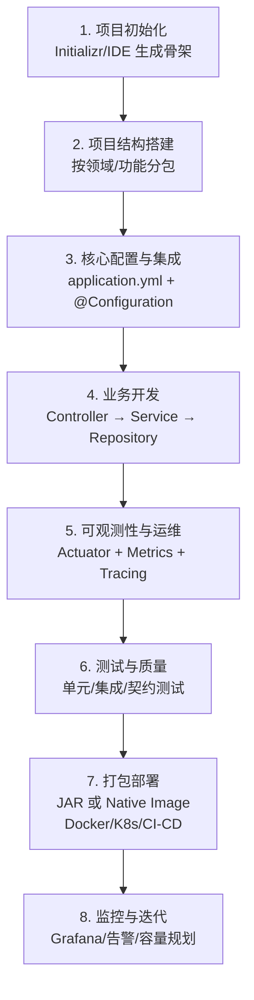

# Spring Boot 4.x 企业级要点速览

Spring Boot 4.x（以 4.0 为起点）是 Spring 生态的一次重要升级，整体方向聚焦在“更细粒度的模块化、更严格的默认约束、更好的可观测性与原生支持”。本文档用于快速了解 4.x 的核心变化、常用组件以及企业级项目的典型构建流程。

说明：具体特性与命名以官方发布与参考文档为准。

## 1. 核心变化概览

- **基础升级**：基于 Spring Framework 7，全面转向 Jakarta EE 11。
- **模块化自动配置**：引入 Modular Auto-Configuration，将原先较大的 `spring-boot-autoconfigure` 拆分为更细粒度模块，带来：
  - 更小的产物体积（artifact/JAR）
  - 更快的启动与更清晰的依赖边界
  - 更易维护与更可控的自动配置加载
- **更严格的默认约束**：
  - 更严格的配置校验与一致性检查
  - 更强的安全默认配置（配合 Spring Security 7）
- **开发者体验增强**：
  - null-safety（JSpecify）
  - 可观测性（Observability）体系更“开箱即用”
  - 原生镜像（GraalVM Native Image）与 AOT 支持进一步增强
- **企业级能力补强**：
  - HTTP Service Clients（声明式接口客户端，如 `@HttpExchange` 风格）
  - API Versioning（API 版本治理能力）

## 2. Spring Boot 4.x 主要组件（Starters 与核心模块）

Spring Boot 通过 Starters（依赖描述符）简化依赖管理。4.x 更强调模块化：通常遵循命名规则：

- `spring-boot-starter-<technology>`：面向应用使用的 Starter
- `spring-boot-<technology>`：更偏底层的功能模块（被 Starter 组合/引用）

下表为企业级项目常用组件的“重点清单”（非完整列表，强调常用与 4.x 方向性变化）。

| 组件/Starter 类别 | 主要 Starter 示例 | 用途说明 | 4.x 新/增强方向（概述） |
|---|---|---|---|
| 核心/基础 | `spring-boot-starter`<br>`spring-boot-starter-test` | 提供自动配置、嵌入式服务器基础能力与测试框架（JUnit 5、Mockito 等）。 | 模块化拆分使依赖更干净；测试链路更轻量；配置验证更严格。 |
| Web（MVC / WebFlux） | `spring-boot-starter-webmvc`<br>`spring-boot-starter-webflux` | 构建 REST API / Web 应用；支持嵌入式 Tomcat/Jetty/Netty。 | WebMVC 命名调整；更偏好 `PathPattern`（传统 `AntPathMatcher` 逐步淡出）；引入/强化声明式 HTTP Service Clients。 |
| 数据访问（JPA / JDBC） | `spring-boot-starter-data-jpa`<br>`spring-boot-starter-jdbc` | ORM（Hibernate 7）、连接池（HikariCP）、事务管理。 | Jakarta/JPA 版本演进；模块化 autoconfig 减少无用依赖与类路径探测成本。 |
| 安全 | `spring-boot-starter-security` | 认证、授权、OAuth2、JWT、多因素认证（MFA）。 | Spring Security 7 增强；更严格的安全默认配置与更明确的最佳实践路径。 |
| 消息/集成 | `spring-boot-starter-amqp`<br>`spring-boot-starter-kafka`<br>`spring-boot-starter-integration` | RabbitMQ、Kafka、消息驱动集成。 | 协议/客户端能力增强；与可观测性更深度整合。 |
| 可观测性/监控 | `spring-boot-starter-actuator`<br>`spring-boot-starter-opentelemetry` | 健康检查、Metrics、Tracing、日志；与 Prometheus/Grafana/OTLP 集成。 | 提供更“零配置”的 OTLP 导出体验；更 opinionated 的观测默认值与约定。 |
| 缓存/缓存抽象 | `spring-boot-starter-cache` | Redis、Caffeine 等缓存抽象。 | 模块化后按需引入，更好控制启动与依赖。 |
| 验证/国际化 | `spring-boot-starter-validation` | Bean Validation（Jakarta Validation 3.x）。 | 对 Kotlin/Records 等模型形式支持更完善。 |
| 其他企业级 | `spring-boot-starter-data-rest`<br>`spring-boot-starter-graphql` | RESTful 数据暴露、GraphQL 等。 | API 版本治理能力更完善；序列化/接口客户端等生态扩展更顺滑。 |

补充说明：

- **经典 Starters 仍可用**：4.x 通常会保留便于迁移的“经典 starter POM”，用于平滑从 3.x 过渡。
- **模块化优势**：不再被动拉入“整个大包”，只加载实际使用的自动配置模块，降低 artifact 大小与启动开销。
- **项目初始化建议**：优先使用 Spring Initializr（https://start.spring.io）创建项目；Java 17+；构建工具使用 Maven/Gradle 的较新版本并保持一致。

## 3. 企业级项目结构建议（分层/领域化）

常见选择包括：分层架构（Layered Architecture）、模块化单体（Modular Monolith）或微服务。无论选择哪种模式，建议以“领域/功能”组织包结构，保持职责单一、依赖方向清晰。

示例（单体项目常见结构）：

```text
com.example.enterprise
├── config
├── controller
├── service
├── repository
├── entity
├── dto
│   ├── request
│   └── response
├── exception
├── security
├── util
└── application.yml
```

关键点：

- Controller 负责协议与协调，Service 承载业务规则，Repository 负责数据访问。
- 使用 DTO 隔离接口模型与持久化实体，避免实体泄露到 API 层。
- 统一异常处理（`@ControllerAdvice`）与统一响应模型（如 `Result<T>`）提升一致性。

## 4. 企业级 Spring Boot 项目构建流程（文本流程图）

下面是一个“可落地”的企业级开发流程概览，便于对齐团队协作与工程化实践。



流程关键点：

- **分层职责明确**：避免 Controller 堆业务逻辑；避免 Repository 承担业务规则。
- **配置外部化**：按 `dev/test/prod` 区分配置，敏感信息使用安全的 secrets 管理。
- **云原生友好**：结合容器镜像分层、构建流水线与运行时观测，缩短交付与定位成本。

## 5. 组件用途补充（落地视角）

- **Web 层**：处理 HTTP 请求与响应；4.x 更推荐声明式 HTTP Service Clients，逐步替代传统同步客户端的旧用法。
- **数据层**：JPA 负责 ORM，结合 Flyway/Liquibase 进行数据库迁移；必要时引入模块化的迁移策略与治理手段。
- **安全**：基于 Spring Security 构建 RBAC、OAuth2、JWT；企业级需重点关注 MFA、最小权限、零信任接入与审计。
- **可观测性**：Actuator 暴露健康与指标端点；配合 OpenTelemetry 输出 Tracing/Metrics 到统一观测平台。
- **缓存与消息**：缓存降低数据库压力；消息队列用于异步解耦与削峰填谷；注意幂等、重试与可观测性贯通。

## 6. 初始工程化建议（可直接作为项目基线）

- **依赖管理**：使用 `spring-boot-starter-parent` 或 Gradle 插件做版本对齐；尽量避免手动锁版本导致漂移。
- **配置策略**：优先 `application.yml`；按 Profile 分环境；敏感配置使用 Vault/云厂商 Secrets/密钥管理服务。
- **代码规范**：优先构造函数注入；DTO 映射可用 MapStruct；减少字段注入与隐式依赖。
- **性能与扩展**：合理配置连接池与线程池；按需启用异步；在需要时引入 AOT/Native Image 以降低启动与内存开销。
- **交付部署**：推荐 Docker + Kubernetes；在 CI/CD 中加入测试、质量门禁（如静态检查）与可观测性检查。

## 7. 下一步可深入方向

- 多模块 Maven/Gradle 项目的推荐拆分方式（模块边界与依赖约束）
- Security（OAuth2/JWT/MFA）在企业环境的落地配置与最佳实践
- JPA/Flyway/Liquibase 的迁移策略与回滚治理
- Redis/Kafka 的生产化配置（序列化、幂等、重试、监控）
- Native Image / AOT 的构建与常见兼容性问题处理
